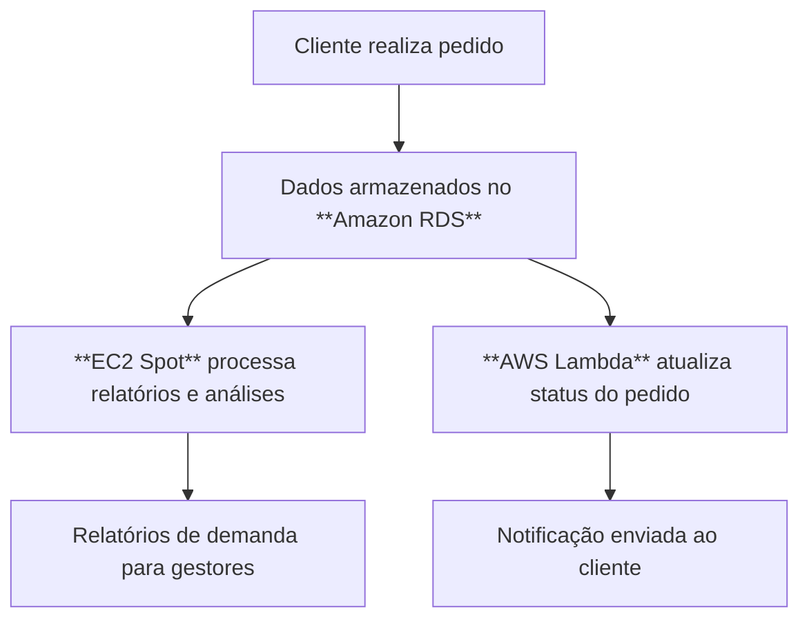

# RELATÓRIO DE IMPLEMENTAÇÃO DE SERVIÇOS AWS

**Data**: 01° semestre de 2026  
**Empresa**: Abstergo Industries   
**Responsável**: Bruno Guedes

## Sumário Executivo
Este relatório apresenta a proposta de implementação de serviços AWS na empresa **Abstergo Industries**.  
O objetivo é estruturar uma base tecnológica em nuvem para suportar operações críticas da empresa:  
- **Banco de dados centralizado** (Amazon RDS)  
- **Computação para análise de dados** (Amazon EC2 Spot Instances)  
- **Automação de processos de pedidos** (AWS Lambda)  

Com essa implementação, espera-se **redução de custos**, **maior eficiência operacional** e **escalabilidade** para acompanhar o crescimento da empresa.

---

## Descrição do Projeto
O projeto foi dividido em 3 etapas principais:

### Etapa 1: 
- **Amazon RDS**  
- **Foco da ferramenta:** Banco de dados relacional gerenciado.  
- **Descrição de caso de uso:**  
  Armazenar informações de estoque, pedidos e clientes em um banco de dados seguro e escalável. O RDS cuida de backups, atualizações e alta disponibilidade, reduzindo custos de manutenção de servidores físicos.

### Etapa 2: 
- **Amazon EC2 Spot Instances**
- **Foco da ferramenta:** Computação de baixo custo para análise de dados.  
- **Descrição de caso de uso:**  
  Executar análises de demanda e relatórios de vendas em instâncias Spot, que oferecem economia significativa. Ideal para tarefas não críticas em tempo real, como previsões de consumo de medicamentos.

### Etapa 3: 
- **AWS Lambda**
- **Foco da ferramenta:** Computação serverless para automação.  
- **Descrição de caso de uso:**  
  Automatizar processos do sistema de pedidos, como envio de notificações e atualização de status. O Lambda garante que a empresa pague apenas pelo tempo de execução, sem necessidade de manter servidores ativos.

---

## Comparativo de Benefícios

| Serviço AWS              | Uso Prático na Empresa                  | Benefícios |
|---------------------------|-----------------------------------------|------------|
| **Amazon RDS**            | Banco de dados de estoque e pedidos     | Confiabilidade, backups automáticos, escalabilidade |
| **EC2 Spot Instances**    | Análises de demanda e relatórios        | Economia de até 90%, flexibilidade |
| **AWS Lambda**            | Automação de pedidos e notificações     | Redução de custos, agilidade, integração fácil |

---

## Fluxo Básico dos Processos

---

## Roadmap de Evolução
1. **Fase 1 (Atual):** Implementação de RDS, EC2 Spot e Lambda.  
2. **Fase 2 (Próxima):** Adicionar **Amazon CloudWatch** para monitoramento e alertas.  
3. **Fase 3 (Futuro):** Implementar **AWS IAM** para controle de acessos e segurança.  
4. **Fase 4 (Expansão):** Explorar **Amazon QuickSight** para dashboards de BI e relatórios visuais.  

---

## Conclusão
A implementação dos serviços AWS na empresa Abstergo Industries proporcionará:  
- Redução de custos imediatos.  
- Maior eficiência na gestão de dados e pedidos.  
- Escalabilidade para acompanhar o crescimento.  
- Automação de processos internos, aumentando a produtividade.  

Recomenda-se a continuidade da utilização das ferramentas e a evolução gradual para novos serviços que tragam ainda mais valor.

---

## Anexos
Os anexos foram organizados em um documento separado para melhor visualização.  
Acesse-os pelos links abaixo:

- [Manual de boas práticas do Amazon RDS](anexos.md#documentação-de-referência)  
- [Guia de configuração do Amazon EC2 Spot Instances](anexos.md#documentação-de-referência)  
- [Documentação das funções Lambda implementadas](anexos.md#documentação-de-referência)  
- [Planilha de estimativa de custos mensais](anexos.md#planilha-de-estimativa-de-custos)  
- [Fluxograma detalhado dos processos de pedidos](anexos.md#fluxograma-detalhado-dos-processos-de-pedidos)
